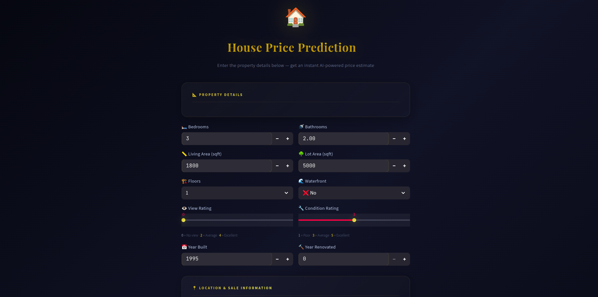

# 🏠 House Price Prediction using Machine Learning

Predict house prices based on property characteristics using Machine Learning. This project covers the complete data science workflow, from data preprocessing and exploratory data analysis (EDA) to model comparison and deployment with Streamlit.

---

## 📌 Project Overview

The objective of this project is to build a machine learning model capable of predicting house prices using various house features such as living area, number of bedrooms, bathrooms, location, condition, and more.

The project compares multiple regression algorithms and deploys the best-performing model through an interactive Streamlit web application.

---

## 🚀 Live Demo


https://your-app.streamlit.app

---

## 📷 Application Preview

(Add screenshots here)

| Home Page  | Results |
|-----------|---------|
|  |  |

---

## 📊 Dataset

Dataset Source:

https://www.kaggle.com/datasets/shree1992/housedata

The dataset contains information about **4,600 residential properties** including:

- House price
- Number of bedrooms
- Number of bathrooms
- Living area
- Lot area
- Number of floors
- Waterfront
- View
- House condition
- Year built
- Year renovated
- City
- Date of sale

---

## 🎯 Project Workflow

### 1. Data Exploration (EDA)

- Dataset overview
- Statistical summary
- Missing value analysis
- Duplicate detection
- Unique value inspection

---

### 2. Data Cleaning

Performed several preprocessing steps:

- Removed houses with price = 0
- Removed duplicate records
- Removed unnecessary columns:
  - street
  - country
- Extracted:
  - year
  - month
  - day
  from the date column
- Applied One-Hot Encoding on city
- Checked feature types
- Prepared dataset for machine learning

---

### 3. Feature Engineering

Created machine learning ready features by:

- Encoding categorical variables
- Creating numerical date features
- Removing irrelevant information

---

### 4. Multicollinearity Analysis

Variance Inflation Factor (VIF) analysis was performed to detect highly correlated features.

Perfect multicollinearity was identified between:

- sqft_living
- sqft_above
- sqft_basement

The redundant features were removed before model training.

---

## 🤖 Machine Learning Models

Three regression models were trained and evaluated.

### Linear Regression

- MAE: **134,469**
- RMSE: **221,188**
- R² Score: **0.671**

---

### Decision Tree Regressor

- MAE: **165,616**
- RMSE: **318,611**
- R² Score: **0.318**

---

### Random Forest Regressor

(Hyperparameter tuned)

- MAE: **132,310**
- RMSE: **238,208**
- R² Score: **0.619**

---

## 🏆 Best Model

Based on model evaluation,

**Linear Regression** achieved the best overall performance on this dataset.

---

## 📈 Feature Importance

The most influential features were:

1. Living Area
2. Bathrooms
3. Year Built
4. Lot Area
5. View
6. Floors
7. Bedrooms
8. Condition

---

## 💻 Streamlit Application

The project includes an interactive Streamlit application where users can:

- Enter house characteristics
- Select the city
- Predict the estimated house price instantly

---

## 🛠️ Technologies Used

### Programming Language

- Python

### Libraries

- Pandas
- NumPy
- Scikit-learn
- Matplotlib
- Streamlit
- Joblib

---

## 📂 Project Structure

```
House-Price-Prediction/
│
├── app.py
├── house_price_model.pkl
├── columns.pkl
├── requirements.txt
├── README.md
│
├── analysis.ipynb
│   
│
├── images/
│
└── data.csv
    
```

---


## 📊 Model Evaluation

| Model | MAE | RMSE | R² |
|---------|-----------:|-----------:|-------:|
| Linear Regression | 134,469 | 221,188 | **0.671** |
| Decision Tree | 165,616 | 318,611 | 0.318 |
| Random Forest | 132,310 | 238,208 | 0.619 |

---

## 📌 Future Improvements

Possible enhancements include:

- XGBoost Regressor
- CatBoost Regressor
- Hyperparameter optimization using GridSearchCV
- Cross-validation
- Pipeline implementation
- Feature selection
- Advanced visualizations
- Model explainability using SHAP

---

## 👩‍💻 Author

Developed by **Baya Ouahabi**

GitHub:
https://github.com/Bayaou

---

## ⭐ If you found this project useful

Please consider giving the repository a ⭐ on GitHub.


this read me i want it to be more optimize then this
